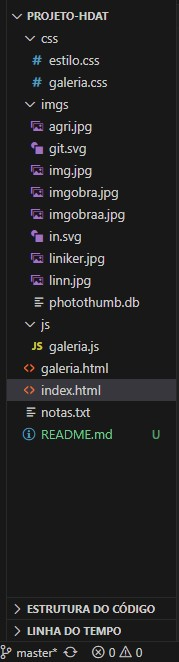

## Apresentação

### Quem é a Losa Nascimento? 
 

 HABLAR UM POUCO SOBRE VOCÊ E MUDAR PARA O SEU INSTAGRAM

#### Contatos

-  [E-mail](losabreu13@gmail.com) 

-  [LinkedIn](https://www.linkedin.com/in/losanascimento/) 

-  [GitHub](https://github.com/losanascimento)  

## Conhecendo o projeto (História da Arte Travesti) 

### 🧠 Contexto

Site desenvolvido para o projeto final do curso de front end pelo Reprograma com o obejtivo de criar algo com impacto social. 

### O site conterá 4 páginas:

* Início

* Galeria

* Conheça a HDAT

## Estrutura do projeto

 

 

##  `Tecnologias que utilizei` 

| `HTML` |  

| `JS` |  

| `CSS` | 

| `Github` | 

 

###  `Como rodar o projeto localmente`  /

Siga os passos e inclua as informações abaixo:

|&nbsp;&nbsp;&nbsp;&nbsp; Passo &nbsp;&nbsp;&nbsp;&nbsp;&nbsp;| &nbsp;&nbsp;&nbsp;Comando/informação &nbsp;&nbsp;&nbsp;|

| Faça o fork | `botão de forkar` |

| Faça o clone | `git clone` |

 

## Citação e Agradecimento 

Por fim, quero agradecer a mim mesma por acreditar, insistir e confiar no processo. Meu primeiro curso onde fiz questão de não faltar nenhuma aula e me dedicar 100% em tudo, a prova tá aí! Obrigada, meninas! Obrigada, Reprograma!

Luna <3 